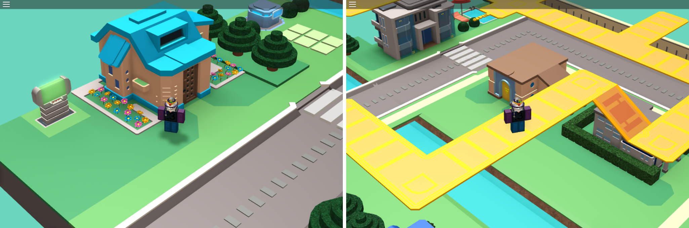

# Echo Ridge

This is a recreation of the Echo Ridge level in Mega Man Star Force 3, built on [ROBLOX](http://roblox.com). Some functionality has been added, but it's primarily a building showcase. You can play it for yourself [here][game-link].

I made a recreation of Echo Ridge back in 2011, but I felt it didn't do the real map justice. So I set out to recreate it from the ground up, using all of ROBLOX's new features (most notably, solid modelling).

[][game-link]

The game has been in progress for a while, and now things are starting to take shape. The game looks considerably better than it's predecessor, and it has more features to boot!

There's a lot of internal stuff going on that the user doesn't see (that you could go through in this repo if you were so inclined), but the most apparent features are the locked camera and the ability to use the Wave Station to teleport onto the Sky Wave.

There's still more to do before completion (maybe even some game mechanics), but we're getting there. I hope you'll join me for the ride :)

## Contributing

If you're interested in helping out, these are the steps to getting started:

- Install [Studio Bridge](https://github.com/vocksel/studio-bridge) on your machine.
- Read up on the [style guide](https://github.com/VoxelDavid/roblox-style-guide) for this project.

Studio Bridge allows us to automatically sync changes from the filesystem to Roblox Studio. You'll be using this in your workflow while coding for the project.

The level geometry is closed source, so you can only modify the code. The development map is used to supplement this by having instances that the source code points to, without including the actual models.

Clone the repo to your computer and run the following commands:

```shell
$ cd echo-ridge/
$ studio-bridge src/
```

The Studio Bridge server will now be running. Open the development map and use  the Studio Bridge plugin to sync the codebase. Any changes made will sync automatically.

[game-link]: http://www.roblox.com/games/13525723/view?rbxp=1343930
